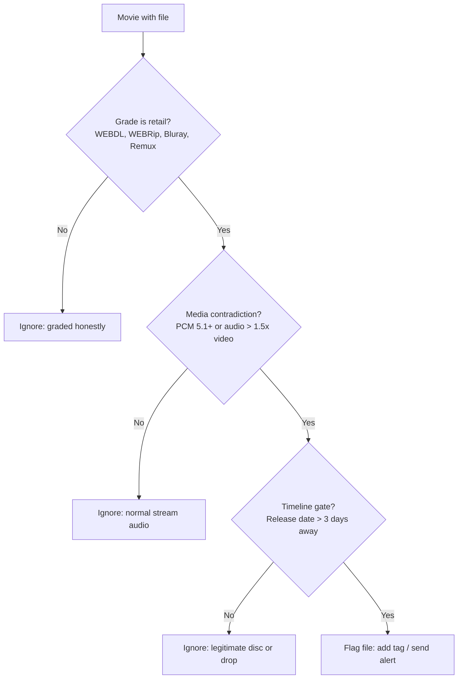
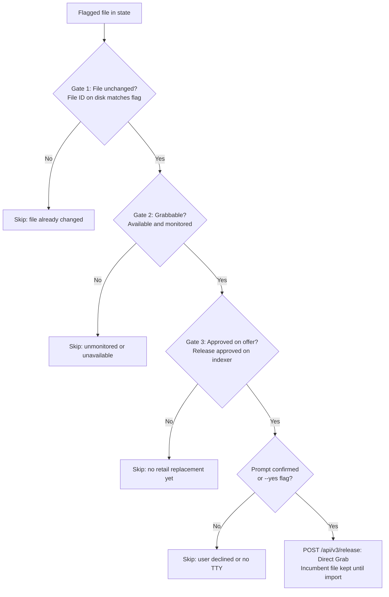

# Verifyarr

Checks whether the file you actually have matches the quality Radarr graded it as.

Radarr stores what it found when it imported a file, in `movieFile.mediaInfo`. Nothing reads it. This does. If the media contradicts the grade, you get told, a tag, or a Telegram message.

**Report only by default.** 

There is an opt-in `replace` mode that instructs Radarr to directly grab a verified retail replacement without deleting the incumbent file first. Read [Replace mode](#replace-mode) before you turn it on.

## What it will never do

- Sonarr. This is Radarr only: movie release timelines (digital vs physical dates) provide a clear ground-truth retail window that episodic TV metadata lacks.
- Touch your download client. It talks to Radarr's API and nothing else.
- Run anything on your host. No sudo, no systemctl, no Docker socket, no shell commands.
- Call an LLM, phone home, or send telemetry.
- Use a database or a lock file. One JSON state file, written only when it changes.
- Guess. Unknown retail dates, unreadable media info and missing fields all mean no verdict, never a plausible-looking one.

## The problem it solves

Custom formats have no conditions for media properties. They match the release title, source, resolution, size, release group and a few others, never what the file actually contains. A Radarr maintainer confirmed it in public while closing a feature request on 2026-09-28:

> While it doesn't have specific conditions for mediainfo, those cases are typically handled by including mediainfo in the file naming scheme.

That last part is the problem. The naming scheme is derived from the release title, and the title is exactly what is lying. A download can be graded `WEBDL-1080p`, satisfy your profile cutoff, and turn out to be an uncompressed-audio capture wearing a retail label. Nothing in the stack can see it.

The second half is quieter and worse. On my own server, a file met its cutoff and stopped being watched. When the genuine retail release appeared, nothing replaced it: the queue stayed empty, no grab was recorded, and the only path left was RSS catching the release while it was still fresh in the feed. Radarr's upgrade searches follow its Cutoff Unmet list, and a file that satisfies its cutoff is not on that list. That is the window `replace` mode narrows.

## How this differs from other tools

- **Checkrr** scans your library with ffprobe, magic numbers, mimetypes and hashes, and its own description says it catches corrupt, mislabelled or unplayable files.

  That "mislabelled" is format level: an MKV that is not really an MKV. A perfectly valid, playable capture wearing a retail label passes Checkrr and fails this.

- **Healarr** does the same kind of job for corrupt media, watching files and re-acquiring them through the arrs.

  Corruption again, not a false claim about quality. A file can be immaculate and still be the wrong thing.

- **Tdarr** is the one you could build this in, since it already probes every file and has check plugins for bitrate, codec and channels.

  Those plugins compare against numbers you set. Nothing in Tdarr knows what quality Radarr graded the file, which is the difference between a threshold and a contradiction.

## Install

Python 3, standard library only. No pip, no venv, no container required.

### Direct (Python 3)

```bash
git clone https://github.com/Aresitoo/verifyarr.git && cd verifyarr
cp config.example.json config.json     # then put your Radarr URL and API key in it
python3 verifyarr.py doctor            # confirms config, connectivity, and how many movies it sees
python3 verifyarr.py scan              # the actual check; report mode only tags and remembers
```

It is standard library only throughout, so there is nothing to compile and nothing platform specific. The suite passes on Python 3.12 on Windows and on 3.14 on Linux. Run it either way:

```bash
python3 tests/test_verifyarr.py        # prints 62/62, exits non-zero on failure
pytest tests/test_verifyarr.py
```

### Docker

A minimal Alpine image is provided for container hosts (Unraid, TrueNAS, Synology, Docker Compose):

```bash
git clone https://github.com/Aresitoo/verifyarr.git && cd verifyarr
cp config.example.json config.json     # fill in your Radarr URL and API key
docker build -t verifyarr .            # .dockerignore keeps config.json out of the build context
```

Run a scan:
```bash
touch verifyarr-state.json             # create it first, see below
docker run --rm --read-only \
  --user "$(id -u):$(id -g)" \
  -v "$(pwd)/config.json:/app/config.json:ro" \
  -v "$(pwd)/verifyarr-state.json:/app/verifyarr-state.json" \
  verifyarr scan
```

Three things in that command are deliberate.

**`touch verifyarr-state.json` first.** Docker creates a *directory* when you bind-mount a host path that does not exist yet, and the tool would then fail to write its state file.

**`--user "$(id -u):$(id -g)"`.** The image runs as uid 1000 by default, so it does not leave root-owned files in your appdata. If your host uses a different uid, Unraid is commonly 99:100, override it as shown or the state file will end up belonging to the wrong user.

**`--read-only`.** The container root filesystem is mounted read-only for security; verifyarr writes nothing but the state file.

## Configuration

| key | default | what it does |
|---|---|---|
| `radarr.url` | – | your Radarr instance, e.g. `http://127.0.0.1:7878` |
| `radarr.api_key` | – | Settings, General, API Key |
| `mode` | `report` | `report` or `replace`. See below. |
| `state_file` | `verifyarr-state.json` | where flags and tombstones are remembered |
| `timeout` | `30` | HTTP request timeout in seconds |
| `tag.enabled` | `true` | tag flagged movies in Radarr itself |
| `tag.label` | `verifyarr-suspect` | the tag name; created if missing |
| `telegram.enabled` | `false` | optional second channel |
| `telegram.token` | – | Telegram Bot API token |
| `telegram.chat_id` | – | Telegram chat or channel ID |
| `telegram.thread_id` | – | optional forum topic / thread ID |
| `predicate.min_days_to_retail` | `3` | the load-bearing one. See Known limits. |
| `predicate.thin_video_bps` | `3500000` | what counts as thin video for the inversion signal |
| `predicate.audio_ratio` | `1.5` | audio bitrate versus video bitrate |
| `predicate.pcm_min_channels` | `5` | uncompressed audio at this many channels or more |

Tagging is the default notification on purpose: no bot, no chat ID, no extra service, and the result is visible in Radarr's own UI. Telegram is optional and never required.

## What counts as a match

Three independent things have to agree before anything is flagged:



1. **The grade says retail.**  
   The file is graded `WEBDL`, `WEBRip`, `Bluray` or `Remux`, so Radarr already believes it is retail grade. HDTV and CAM rips are excluded, because those are graded correctly and need no help.
2. **The media contradicts it.**  
   Uncompressed 5.1+ PCM, which is a disc or line-capture signature, since streams deliver DD+, AAC or EAC3 and never raw PCM, or an audio bitrate more than 1.5x a video bitrate under 3.5 Mbps.
3. **The timeline allows it.**  
   The digital release date, or the physical date for Bluray and Remux claims, is still more than 3 days away.

### Example: What detection looks like

**Terminal output (`verifyarr scan`):**
```text
$ python3 verifyarr.py scan
NEW  Coyote vs. Acme [Coyote.vs.Acme.2026.1080p.WEBRip.mkv]  graded WEBDL-1080p
        - uncompressed PCM 6-channel audio (6.9 Mbps), which is a disc or line-capture signature rather than a stream
        - audio bitrate is 2.6x the video bitrate (video only 2.6 Mbps)
        - the digital release is still 9.4 days away
tagged: Coyote vs. Acme
1 flagged file(s).
```

* In Radarr: The movie is tagged with `verifyarr-suspect`.
* In Telegram (if enabled):
  ```text
  Verifyarr: Coyote vs. Acme is graded WEBDL-1080p but the media says otherwise:
    - uncompressed PCM 6-channel audio (6.9 Mbps), which is a disc or line-capture signature rather than a stream
    - audio bitrate is 2.6x the video bitrate (video only 2.6 Mbps)
    - the digital release is still 9.4 days away
  ```

When your library has no suspect files:
```text
$ python3 verifyarr.py scan
no flagged files. 0 entr(y/ies) in state.
```

## Replace mode

Off unless you set `mode` to `replace`, or pass `replace` as the command, which overrides the config. Grabbing a replacement always needs a prompt or `--yes`. It re-checks three things immediately before acting and skips with a printed reason if any of them fails:



1. the file on disk is still the file that was flagged, so a stale run can never act on a newer file;
2. Radarr reports the movie as available and monitored, because it will not grab for an unmonitored movie;
3. something Radarr itself accepts is on offer, meaning a release with `approved: true`, valid `guid`, and positive `indexerId`.

Then it sends a direct grab command to Radarr (`POST /api/v3/release`) targeting the highest-scoring approved release. Radarr queues the download in your download client and upgrades the file upon import. **The incumbent file is never deleted in advance**, so if the download stalls or an indexer fails, your existing file remains safe on disk.

Without `--yes` it prompts before each grab, and `--dry-run` prints what it would do without touching anything.

```bash
python3 verifyarr.py replace --dry-run     # show the plan
python3 verifyarr.py replace               # ask before each grab
python3 verifyarr.py replace --yes         # unattended, for cron
```

### Example: What replacement looks like

**Interactive prompt (`verifyarr replace`):**
```text
$ python3 verifyarr.py replace
READY Coyote vs. Acme: Coyote.vs.Acme.2026.1080p.AMZN.WEB-DL.DDP5.1.Atmos.H.264-BYNDR
      grabs release from indexer 5 without deleting incumbent file (1 approved option(s), best score 864080)
      proceed? [y/N] y
nothing outstanding.
```

**When no retail release is on offer yet (Gate 3 protects the file):**
```text
$ python3 verifyarr.py replace
skip 61:40: no approved replacement on offer yet
1 item(s) still awaiting retail.
```

## Exit codes

`0` nothing found, `1` something was flagged, `2` configuration or API error. In `replace` mode the exit code answers a different question, whether anything is still outstanding, so `0` means the run had nothing left to do. Either way it works directly in cron with `||`, or wherever you already collect alerts.

## Scheduling

Run a periodic scan every 6 hours:

**Linux Cron (`crontab -e`):**
```cron
0 */6 * * * cd /opt/verifyarr && python3 verifyarr.py scan >/dev/null 2>&1
```

**Unraid User Scripts:**
Schedule a custom script set to **Every 6 Hours**:
```bash
#!/bin/bash
cd /mnt/user/appdata/verifyarr && python3 verifyarr.py scan
```

## Known limits

These are deliberate, not oversights.

- **The timeline gate is what protects legitimate disc rips.** 

  Uncompressed LPCM is normal on some Blu-rays and concert discs. With gate 3 in place those files are never flagged, because their retail date is in the past. If you set `min_days_to_retail` to `0` or lower, you will start accusing people's own discs. That setting is for tuning, not for disabling.

- **It does not fix anything in report mode.** 

  It tells you, tags the movie, and stops. You decide.

- **Unknown retail dates produce no verdict.** 

  If a movie has no digital or physical date, nothing happens, by design. Silence beats a guess.

- **Replace deletes first, then asks Radarr to search.** If that search finds nothing it accepts, the movie is left with no file at all. That is why the three gates exist and why the prompt is on by default rather than off.

- **It catches a rare problem.** 

  Once per mislabelled file, not once a week. If you never grab pre-retail rips and your indexers are honest, it will sit there finding nothing, which is the point.

- **The predicate has a twin.** 

  The same logic runs inside my own media doctor. `tests/test_verifyarr.py` is the contract that keeps the two honest: same inputs, same answers, including the negative cases. If you change behaviour in one, a test fails for the other.

- **Radarr may one day do this natively.** 

  Then this is a stopgap, and that would be a fine outcome.

## AI involvement

I wrote this with heavy AI assistance, and the tests exist because of that. The parts that are not AI-generated are the facts. They came from running this against a real server and a real mislabelled file, and the ones that matter are written down here with dates and values you can check against your own Radarr.

## License

MIT. Use it, change it, ship it, just keep the copyright notice. There is no warranty, which for a tool that can delete a file is worth actually reading rather than skipping.
